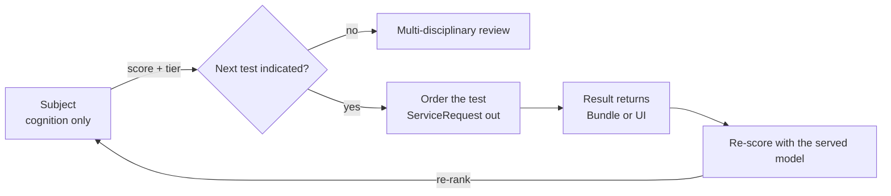
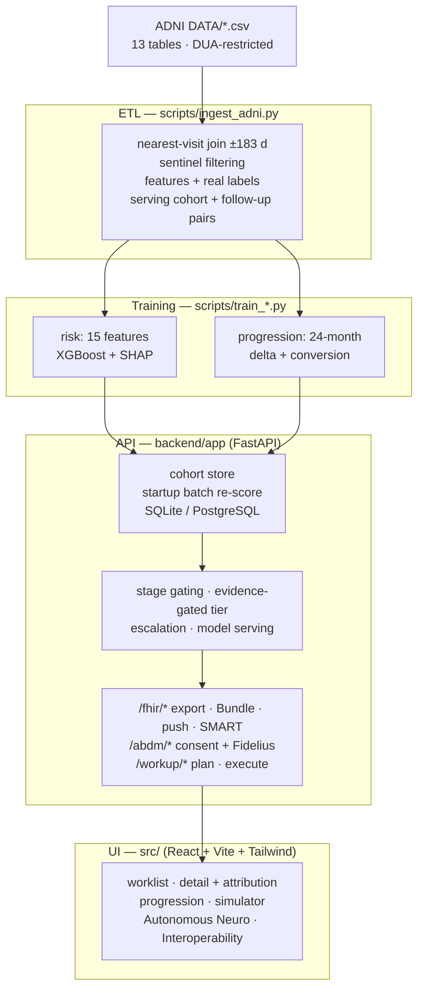

# NeuroPilot

### AI-driven prioritization for early Alzheimer's diagnostic pathways

*Precision Care Challenge 2026 — a clinical decision-support prototype.*

NeuroPilot scores a dementia cohort from **cognition, blood biomarkers, MRI
volumetrics and PET**, explains every score with SHAP, and moves each patient
down a fixed pathway: **Cognitive → Blood → MRI → PET**. It can walk that
pathway unattended — rank the cohort, choose the next patient, order the test,
re-score, re-rank — and it speaks **HL7 FHIR R4** and the **ABDM (India) consent
flow**, so it can live *inside* a hospital network instead of beside it.

> [!IMPORTANT]
> **NeuroPilot never outputs a diagnosis.** Every screen and every API contract
> carries one of three things: a **risk tier**, the **reasoning** behind it, and
> a **recommended next test**. No `Condition` resource is emitted in either
> direction. The decision is the clinician's.

| | |
|---|---|
| **Cohort** | 3,636 real ADNI subjects · 2,581 served |
| **Risk model** | XGBoost, 15 features · CV AUC **0.901** · test AUC **0.902** |
| **Progression** | 24 months on real follow-up · conversion AUC **0.796** |
| **Tests** | **229 passing** |
| **Interoperability** | FHIR R4 phases 1–4 · ABDM consent flow (mock gateway) |

Everything below was re-verified against the served artifacts and the live
cohort on **25 Sep 2026**. Where something is unverified, blocked, or still
broken, it says so.

---

## Contents

| | | |
|---|---|---|
| [1. The product in one minute](#1-the-product-in-one-minute) | [7. Repository map](#7-repository-map) | [13. Configuration](#13-configuration) |
| [2. The loop, drawn](#2-the-loop-drawn) | [8. Risk model card](#8-risk-model-card) | [14. Tests](#14-tests) |
| [3. Readiness](#3-readiness) | [9. Progression forecaster](#9-progression-forecaster) | [15. Verification](#15-verification) |
| [4. Quick start](#4-quick-start) | [10. Escalation rules](#10-escalation-rules) | [16. Limitations](#16-limitations) |
| [5. Data policy](#5-data-policy) | [11. API](#11-api) | [17. Out of scope](#17-out-of-scope) |
| [6. Architecture](#6-architecture) | [12. Dashboard](#12-dashboard) | [18. Stack](#18-stack) |

---

## 1. The product in one minute

**The problem.** A memory clinic has more referrals than scan slots. Who gets
worked up first, and with what?

**The answer, in three parts.**

1. **A ranked worklist.** Every subject gets a risk score, a tier, and the SHAP
   factors that produced them. Nothing is hidden behind a number.
2. **A pathway that means something.** A measurement counts only once the
   pathway has *reached* its stage. Ordering the blood panel therefore tells you
   something you did not already know — which is not true if the score has been
   quietly reading the MRI all along.
3. **Automation with a signature.** `/workup/plan` proposes a batch with its
   reasoning and changes nothing. `/workup/execute` acts only on what you
   approved, re-checking every subject against its live state first.

**What it deliberately is not**

- **Not a diagnostic device.** It prioritizes and explains. It never names a
  disease.
- **Not a black box.** Every tier, every order, every re-score carries its
  reasoning and its timestamp.
- **Not a simulation dressed as data.** The risk model and the progression
  forecaster both train on real ADNI labels and real follow-up outcomes. Where
  a projection cannot beat *assume no change*, it is refused rather than shown.
- **Not finished.** [§16](#16-limitations) is a long, honest list.

---

## 2. The loop, drawn



Drop a result in and the queue reorders itself. Order a test and nothing moves
until a real value comes back — no stand-in results, ever.

---

## 3. Readiness

| Area | Status | Evidence |
|---|---|---|
| ADNI ingestion | ✅ Run & verified | 13-table drop, nearest-visit join (±183 d) across MMSE, ADAS-Cog 13, plasma panel, FreeSurfer MRI, amyloid/tau PET, APOE. Sentinel codes filtered, never read as values |
| Risk model | ✅ Run & verified | 3,636 real subjects, 15 features, all four stages · CV AUC **0.901 ± 0.011** · held-out **0.902** · accuracy 0.812 |
| Leakage audit | ✅ Run & verified | CDR and FAQ excluded (both are part of ADNI's diagnostic algorithm) · early stopping moved off the test set · complete-case cross-check ρ = 0.82 |
| Progression forecaster | ✅ Run & verified | 24 months, real follow-up (1,634 pairs · 138 conversions) · MMSE-delta MAE **1.549** (baseline 1.859) · conversion AUC **0.796** |
| Explainability | ✅ Run & verified | Global SHAP with per-stage rollup, plus a *measured-only* view so a rarely-ordered test is not diluted to zero |
| Escalation engine | ✅ Run & verified | Deterministic stage gates, no second ML layer · clinician-in-the-loop `override` · ordering gaps carried forward, never overwritten |
| Autonomous triage | ✅ Run & verified | `/workup/next`, `/run`, `/plan` (read-only), `/execute` (approved subset, re-checked) |
| Cohort filtering | ✅ Run & verified | Subjects with no blood/MRI/PET result anywhere are dropped from the served cohort: 3,636 scored → **2,581 served** |
| Backend API | ✅ Run & verified | FastAPI + Swagger at `/docs` · `/health` names the resolved data source · startup batch re-score |
| PostgreSQL store | ✅ Run & verified (Railway) | Store of record in a deployment · created and seeded on boot · re-seeds when the cohort **or** the served model changes |
| Frontend | ✅ Run & verified | React + Vite + Tailwind · **zero mock data** · clean production build, no console errors |
| FHIR R4 | ✅ Run & verified | Export · atomic inbound ingestion · bidirectional orders/results · SMART launch · 104 tests |
| ABDM (India) | ✅ Run & verified (mock) | Consent → grant → encrypted pull → re-score · Fidelius checked byte-for-byte against published `fidelius-cli` vectors · 28 tests |
| Docker & deploy | ✅ Run & verified | One image: SPA build (node 20) served by FastAPI (`python:3.11-slim`, `$PORT`) · `railway.json` · `docker-compose.yml` |
| CI | ⛔ Not built | Deliberately out of scope |

---

## 4. Quick start

```bash
# ── 1. ML pipeline (once — generates the cohort and the artifacts) ────────────
python -m venv .venv && source .venv/bin/activate    # Windows: .venv\Scripts\activate
pip install -r requirements-ml.txt
# Put the ADNI tables in "ADNI DATA/" first (DUA-restricted — see data/raw/README.md)
python scripts/inspect_adni_coverage.py              # per-modality coverage, read-only
python scripts/run_pipeline.py                       # ingest → risk model → progression

# ── 2. API ────────────────────────────────────────────────────────────────────
pip install -r backend/requirements.txt
cd backend && uvicorn app.main:app --reload          # http://127.0.0.1:8000/docs

# ── 3. Dashboard ──────────────────────────────────────────────────────────────
npm install && npm run dev                           # http://localhost:5173
```

Or the whole thing in one command (needs Docker; mounts `data/processed` and
`artifacts`):

```bash
docker compose up --build          # web :8080 · API docs :8000
```

---

## 5. Data policy

> [!NOTE]
> **This repository contains no patient data.** ADNI is access-controlled under
> a Data Use Agreement and is not redistributable. What ships is the code that
> turns the tables into a model — plus the trained artifacts, so a deploy serves
> both model families without retraining.

| Path | What it is | In git? |
|---|---|---|
| `ADNI DATA/*.csv` | The 13-table ADNI drop | ❌ never |
| `data/processed/risk_scores.json` | Per-subject scores + attributions, written **de-identified** | ✅ yes |
| `data/processed/adni_*.{json,csv}` | Serving records, training matrix, visit table, follow-up pairs | ❌ gitignored |
| `artifacts/pipeline.joblib` + risk model card, SHAP, eval, audit | The served risk model and its evidence | ✅ yes |
| `artifacts/progression_{delta,conversion}.joblib` + card, report, importance | The served forecaster and its evidence | ✅ yes |
| `artifacts/rf_pipeline.joblib`, `progression_projection.joblib` | RF fallback · multi-target projection models | ❌ local only |

### Where the cohort lives in a deployment

An image built from this repository has **no cohort file** to copy — so the
database carries it, seeded once from a machine that legitimately holds the data:

```bash
# once, and again after any retrain — the stored fingerprint folds in the served
# model, so derived scores/tiers/attributions are recomputed
DATABASE_URL='postgresql://user:pw@host:5432/railway' python scripts/seed_db.py
```

Set `PATIENT_DATA=adni` on the service. A healthy boot logs:

```
[api] data source: adni+postgres (2582 patients loaded)   # cohort file + database
[api] data source: postgres    (2582 patients loaded)     # cohort from the database
```

Three guards protect stored patients — each one written after a real deploy went
wrong:

- **An empty cohort never seeds.** A container that cannot find the cohort file
  cannot wipe a database that still holds the last good one.
- **Stubs never replace real patients.** With neither file nor database, the API
  reports `mock` instead of overwriting Postgres with demo stubs.
- **A stored cohort that filters to zero is repaired from the file**, never served
  as an empty dashboard.

`scripts/seed_db.py` refuses to run without `DATABASE_URL` and refuses to seed
stubs, so it cannot be aimed at the wrong thing by accident.

---

## 6. Architecture



Layering rules worth knowing: `fhir.py` and `fhir_ingest.py` are **pure**
converters; `service.py` owns mutations; `config.py` owns the two rules that
every path shares — stage gating and the evidence-gated tier.

---

## 7. Repository map

```
.
├── README.md · FHIR_INTEGRATION.md · ABDM_INTEGRATION.md · FHIR_REMAINING.md
├── .env.example                 every supported env var, documented
├── Dockerfile                   node 20 build → python:3.11-slim serving SPA + API on $PORT
├── docker-compose.yml           postgres:16-alpine + api + web (nginx)
├── railway.json                 Railway deploy config
├── requirements-ml.txt          pandas · scikit-learn · xgboost · shap
│
├── ADNI DATA/                   raw tables (gitignored, DUA-restricted)
├── data/raw/README.md           how to obtain the drop · what ingestion writes
├── data/processed/              datasets gitignored · risk_scores.json committed
├── artifacts/                   models · cards · SHAP · eval + audit reports
├── brand_assets/                rendered logo, icon, brand sheet
│
├── scripts/
│   ├── ingest_adni.py           drop → visits / features / labels / serving cohort
│   ├── train_model.py           features → XGB/RF → eval → SHAP → artifacts
│   ├── train_progression_model.py   24-month delta + conversion + projection targets
│   ├── build_projection_targets.py  which attributes are predictable enough to show
│   ├── run_pipeline.py          ingest + both models, one command
│   ├── audit_model_fixes.py     leakage + robustness audit
│   ├── inspect_adni_coverage.py per-modality coverage (read-only)
│   ├── seed_db.py               seed the deployment database
│   ├── refresh_railway.py       push artifacts / reseed a deployed instance
│   ├── validate_fhir.py         server-side $validate gate for exported resources
│   └── render_brand_assets.cjs  regenerate brand_assets from BrandLogo.jsx
│
├── backend/
│   ├── tests/                   229 pytest cases (§14)
│   └── app/
│       ├── main.py · api.py     app factory (serves the built SPA) + routers
│       ├── config.py            thresholds · stage gating · evidence rule · paths
│       ├── schemas.py           Pydantic contracts (no diagnosis field)
│       ├── storage.py · db.py   cohort loading + startup re-score · SQLAlchemy store
│       ├── service.py           business logic: advance, results, workups
│       ├── escalation.py        deterministic stage rule engine
│       ├── model_service.py     served pipeline + batch SHAP
│       ├── progression.py · visits.py    24-month forecast · visit history
│       ├── seed_data.py         placeholder stubs (last resort only)
│       ├── fhir.py              R4 resources (Patient / Observation / RiskAssessment …)
│       ├── fhir_ingest.py       inbound mapper (pure) — atomic, unit-checked
│       ├── fhir_import.py       read a chart over a SMART session · browse a server
│       ├── fhir_client.py       outbound push + reachability probe
│       ├── net.py               shared outbound-HTTP facts (transport errors, URL hygiene)
│       ├── smart.py             SMART on FHIR (OAuth2 + PKCE), tokens server-side
│       ├── fidelius.py          ABDM Fidelius crypto (Curve25519 · HKDF-SHA256 · AES-GCM)
│       └── abdm.py · abdm_mock.py   HIU consent client + mock CM/HIP at /mock-abdm
│
├── src/
│   ├── api.js                   fetch client — the ONLY data source
│   └── components/              Overview · AutoScrollShowcase · Header · AllPatients
│                                PatientDetail · ProgressionView · TrajectoryChart
│                                RiskSimulator · FeatureRadarChart · CohortComposition
│                                CompareView · AutonomousTriage · Interoperability
│                                AbdmPanel · Footer · TierTag · BrandLogo · widgets
│
└── frontend/                    docker-compose dashboard image (nginx → /api)
```

---

## 8. Risk model card

Trained on the real ADNI drop: **3,636 subjects**, one row each at their latest
labelled visit. Labels are the cohort's own clinician assessment —
`1 = MCI or Dementia` · `0 = CN` (2,168 / 1,468; 59.6% impaired). No simulated
label rule anywhere.

| Metric | Value |
|---|---|
| Model | XGBoost (`pipeline.joblib`), RandomForest fallback alongside |
| Features | 15, spanning all four stages |
| 5-fold CV AUC | **0.901 ± 0.011** |
| Held-out test AUC | **0.902** |
| Held-out accuracy @0.5 | 0.812 |
| Stage 1 only (no biomarker) | AUC **0.845** |
| Biomarker measured | AUC **0.921** |
| RF fallback | AUC 0.903 |
| Majority-class baseline | accuracy 0.596, AUC 0.500 |

`age` · `sex` · `education_years` · `apoe_e4` · `mmse` · `mmse_change` ·
`adas_cog_13` · `ptau217` · `abeta4240` · `nfl` · `gfap` ·
`hippocampal_volume` · `hippocampal_icv_ratio` · `centiloids` ·
`tau_meta_temporal`

The held-out number is honest: the early-stopping fold is carved from **train
only**, so the test set is never touched during model selection.

### 8.1 Attribution — mean |SHAP|

`overall` is cohort-wide. `measured` counts only the subjects who actually had
that test, which is the only honest way to read a partially-observed cohort.

| # | Feature | Overall | Measured | Coverage | Stage |
|---|---|---|---|---|---|
| 1 | `adas_cog_13` | 1.070 | 1.204 | 77.9% | 1 · Cognition |
| 2 | `mmse` | 0.974 | 0.974 | 100% | 1 · Cognition |
| 3 | `tau_meta_temporal` | 0.232 | **0.608** | 19.7% | 4 · PET |
| 4 | `centiloids` | 0.249 | **0.433** | 29.3% | 4 · PET |
| 5 | `ptau217` | 0.074 | **0.158** | 30.9% | 2 · Blood |
| 6 | `hippocampal_icv_ratio` | 0.076 | 0.115 | 58.3% | 3 · MRI |
| 7 | `nfl` | 0.033 | **0.113** | 16.9% | 2 · Blood |
| 8 | `hippocampal_volume` | 0.074 | 0.103 | 58.3% | 3 · MRI |
| 9 | `sex` | 0.089 | 0.089 | 99.9% | 1 |
| 10 | `age` | 0.083 | 0.083 | 99.9% | 1 |
| 11 | `mmse_change` | 0.064 | 0.077 | 64.2% | 1 |
| 12 | `abeta4240` | 0.032 | 0.050 | 30.8% | 2 · Blood |
| 13 | `gfap` | 0.012 | 0.047 | 16.9% | 2 · Blood |
| 14 | `education_years` | 0.015 | 0.015 | 99.9% | 1 |
| 15 | `apoe_e4` | 0.017 | 0.014 | 78.7% | 1 · Genetics |

| Stage | Σ mean \|SHAP\| | Share |
|---|---|---|
| 1 · Cognitive / clinical | 2.313 | 74.7% |
| 2 · Blood | 0.150 | 4.8% |
| 3 · MRI | 0.150 | 4.8% |
| 4 · **PET** | 0.482 | **15.6%** |

> **"Isn't it just MMSE?"** No. With cognition held out, **PET carries more
> weight than blood and MRI combined** — 15.6% against 4.8% + 4.8%. PET only
> looks small cohort-wide because 20–29% of subjects have a scan; among those
> who do, tau SUVR is the third-strongest result in the model. Both views ship
> so neither can be quoted misleadingly.

### 8.2 Leakage — what is excluded, and why

ADNI derives `DIAGNOSIS` from clinical staging, so anything in that derivation
leaks the label. Two variables are barred from the feature set:

- **CDR** — the diagnosis is essentially a function of it.
- **FAQ** — functional status, computed inside the same algorithm.

Both are still loaded for provenance and concordance reporting, never as
predictors. **MMSE is kept**: it overlaps with diagnosis through standard
cutoffs but is not deterministic, and a triage tool that could not see a
cognitive score would be useless. That caveat lives in the model card and in
`artifacts/model_audit.txt`.

### 8.3 Tiers require corroborating evidence

The score answers *"how much does this look like the thing we are looking for?"*
The tier answers *"do we have enough to act on?"* Different questions — and
cognition is the test the referral was already based on, so it cannot
corroborate itself.

| Tier | Requires |
|---|---|
| **High** | score > 0.70 **and** ≥ 1 biomarker inside the ordered pathway |
| **Medium** | score ≥ 0.40 — includes cognition-only patients, flagged *awaiting confirmation* |
| **Low** | score < 0.40 |

On the current served cohort (2,581): **111 High · 438 Medium · 2,032 Low**.
Of the **1,459 subjects at Stage 1**, **138 score above 0.70 and are held at
Medium** (mean MMSE 19.5) — their biomarker is on file but sits *beyond* the
pathway, so the score cannot see it either (§8.4). They are promoted
automatically the moment the intervening test is reached.

Two things this deliberately does **not** do:

- **It does not weaken triage.** At Stage 1 both Medium and High order the blood
  panel, so the automation behaves identically — a cognition-only patient is
  still first to be tested.
- **It does not touch attribution.** ADAS-Cog 13 and MMSE stay the top two SHAP
  features because they measurably are (single-feature AUC 0.885 and 0.836).
  Flattening those bars to look more even would misrepresent the model; the
  honest lever was the tier rule.

### 8.4 Ordering gaps, and why the stage stops at the first missing test

Real ADNI is not a tidy funnel — modalities were added across study phases, so
all eight combinations of blood / MRI / PET exist. In the served cohort,
**1,574 records hold a result measured outside the ordered prefix** (blood
1,122 · MRI 2,120 · PET 1,168 are on file; stage counts a *prefix*, not a
maximum).

A "highest completed stage" rule would label those subjects Stage 3/4 and claim
a blood panel that was never drawn — the stepper would then contradict the
record. NeuroPilot defines instead:

> **stage = the length of the complete prefix of the ordered pathway.**

So a subject with an MRI and no plasma panel is **Stage 1**, the rule engine
recommends the missing blood draw, and two things stay true at once:

- **Nothing measured is discarded.** Real MRI/PET values still feed the model
  once the pathway reaches them, and `/patients/{id}` reports `slots_on_file`
  plus `beyond_stage` so the UI can say *already on file* instead of looking
  self-contradictory.
- **A real measurement is never overwritten.** Walking past an already-measured
  slot carries the real values forward — logged as
  `result already on file (normal) — carried forward without re-measurement`.
  Only genuinely missing slots get a derived result. Locked by
  `test_ordering_gap_never_overwrites_a_real_measurement`, which asserts the
  carried record is byte-identical before and after.

Served cohort shape: **1,459 · 332 · 231 · 559** across stages 1–4.

---

## 9. Progression forecaster

Same baseline feature vector as the risk model. Labels are **real ADNI
follow-up outcomes** — a first labelled CN/MCI visit paired with its follow-up
diagnosis: **1,634 pairs · 138 conversions · 8.45% prevalence** (1,307 train /
327 test, split by subject). Horizon: **24 months**.

| Model | Metric | Result |
|---|---|---|
| MMSE-delta regressor | test MAE | **1.549 pts** (mean-baseline 1.859) |
| | RMSE / R² | 2.217 / 0.297 (n = 1,387) |
| Conversion classifier | 5-fold CV AUC | **0.819 ± 0.031** |
| | held-out ROC AUC | **0.796** |
| | PR AUC | 0.386 — ≈4.6× lift over 8.45% prevalence |
| | Brier | 0.089 |
| | accuracy @0.5 | 0.878 (majority baseline 0.914) |
| | by baseline | CN **0.657** (n = 775, 2.97% convert) · MCI **0.761** (n = 859, 13.39%) |

> **Accuracy below the majority baseline is intentional.** At 8.45% prevalence,
> answering "will not convert" for everyone scores 0.914 while carrying no
> information. AUC, PR AUC and Brier are the honest measures here.

### Which attributes are projected — and which are refused

A 24-month value is shown only when the model beats *assume no change* by at
least 10% on CV MAE. On the current run exactly one target clears the bar:

| Target | Gain vs no-change | Shown? |
|---|---|---|
| Hippocampal volume | **+28.7%** | ✅ projected |
| ADAS-Cog 13 | +5.1% | ❌ carried at today's value |
| Centiloids | +6.6% | ❌ carried at today's value |
| Hippocampal / ICV ratio | +0.0% | ❌ carried at today's value |

The refusal and its reason are surfaced on the page rather than hidden. The
projection model is local-only (gitignored), so a deployment reports the same
reasons instead of guessing.

**Guardrails.** Subject-level holdout · conversion defined over a bounded
evaluation window, with subjects whose follow-up is too short **excluded rather
than assumed stable** · a shorter window was rejected for carrying too few
positives to calibrate · baseline features are *first* visits while served
records are *latest* visits · `mmse_change` excluded (present in only 2.5% of
first visits) · `faq_total` excluded (leakage) · the projected tier comes from
re-scoring the **current risk model** on the projected vector, so both model
families stay consistent.

> A flat forecast is a real answer: **ADNI-0500** (stage 1, MMSE 28, score 0.017)
> projects a conversion probability near zero and a Low tier.

---

## 10. Escalation rules

Deterministic stage gates (`backend/app/escalation.py`). No second ML layer.

| Stage | Low | Medium | High |
|---|---|---|---|
| 1 · Cognitive | Re-screen in 12 mo | **Blood panel** | **Blood panel** |
| 2 · Blood | Re-screen in 12 mo | **MRI volumetrics** | **MRI volumetrics** |
| 3 · MRI | Return to screening | Follow-up MRI in 12 mo | **Amyloid / tau PET** |
| 4 · PET | — pathway complete → multi-disciplinary review — | | |

Test-ordering escalations are confirmable. "Schedule / return" recommendations
are **not** auto-escalated: `POST /advance-stage` returns `409` unless the
clinician passes `{"override": true}`. Every transition, order, result and
re-score is timestamped into the subject's audit trail, and mirrored to Postgres
when configured.

---

## 11. API

Pydantic-validated, Swagger at `/docs`. **No response model contains a diagnosis
field.** CORS allows the Vite dev server plus `CORS_ORIGINS`.

### Cohort & decisions

| Endpoint | Behaviour |
|---|---|
| `GET /health` · `GET /debug/env` | Resolved data source + count · deploy diagnostics (database shape, outbound FHIR destination, and whether the configured URL needed trimming — never secrets) |
| `GET /patients?tier=&q=&sort=&page=&limit=` | Ranked worklist. `sort`: `risk-desc`, `risk-asc`, `stage` |
| `GET /patients/{id}` | Full profile: slots, all SHAP `factors`, `history`, `slots_on_file`, `beyond_stage` |
| `GET /patients/{id}/explain` | Score, tier, all factors, global importance |
| `GET /patients/{id}/pipeline` | Stage, stage names, history, `recommended_next` |
| `GET /patients/{id}/refined` | Refined outlook: observed + projected MMSE with a band, top drivers, projected score/tier |
| `GET /patients/{id}/progression` | 24-month forecast: trajectory, conversion probability + drivers, projected tier, per-stage score checkpoints |
| `POST /patients/compare` | Side-by-side comparison of subjects |
| `POST /patients/score` | Score an arbitrary feature vector with the served pipeline + SHAP (powers the simulator) |

### Acting on a record

| Endpoint | Behaviour |
|---|---|
| `POST /patients/{id}/advance-stage` | `{"override": false, "note": null}` → order, carry forward, re-score. `404` unknown · `409` not indicated |
| `POST /patients/{id}/results` | `{"slot", "outcome", "values", "note"}` → re-scores. `422` bad slot **or a value that is not a number in a measurement field** (nothing is written) · `409` nothing pending |
| `POST /patients/{id}/auto-workup` | Per-subject cascade blood → MRI → PET, re-scoring at each step |

### Automation

| Endpoint | Behaviour |
|---|---|
| `POST /workup/next` · `POST /workup/run` | One autonomous step, or up to N: rank → order → re-score → re-rank, returning tier, queue movement, projected-vs-actual and the reason |
| `POST /workup/plan` | **Read-only** proposal batch: four labelled reasons per action, `impact` verdict, projected score and rank. Computed on copies — mutates nothing |
| `POST /workup/execute` | Executes **only the approved subset**, re-checking each subject first. Returns an executed ledger plus every skipped subject with its reason |

### FHIR R4

| Endpoint | Behaviour |
|---|---|
| `GET /fhir/metadata` | `CapabilityStatement` with a SMART security block |
| `GET /fhir/Patient` · `/{id}` · `/{id}/$everything` | Searchset · single read · the complete record as one `collection` Bundle |
| `GET /fhir/Observation?patient=` · `/fhir/RiskAssessment?patient=` | LOINC-coded measurements (MMSE 72106-8 …) · score, tier and SHAP basis |
| `GET /fhir/ServiceRequest?patient=&status=` | Placed orders — `active` = result owed, `completed` = real value on file |
| `GET /fhir/DiagnosticReport?patient=` | Completed panels; the conclusion describes *the test*, never the model |
| `POST /fhir/Bundle` | **Inbound.** `transaction` / `collection` / `document` (NRCES). Prefers the **ABHA address** as subject id, keeps a crosswalk, **idempotent** on ABHA + observation date. Atomic: any unmappable resource or wrong UCUM unit rejects the whole bundle with a 422 `OperationOutcome` naming every offender |
| `POST /ingest/fhir` | Direct ingestion for a HIP pushing without a consent exchange |
| `POST /fhir/push/{id}` | Push orders + results + RiskAssessment + AuditEvent as one atomic FHIR transaction |
| `GET /fhir/status` | Four phases, outbound reachability, SMART session, exchange-surface counts |
| `GET /fhir/smart/launch` | 302 to the authorize URL (PKCE S256, single-use `state`); accepts a per-launch patient and an opaque `launch` context |
| `GET /fhir/smart/charts` | Browse the server's own `Patient` results — the only ids a launch can name |
| `GET /fhir/smart/callback` | Exchanges the code, holds the token server-side, returns the browser with `?smart=connected&patient=…`; failures return `?smart=error&reason=…` instead of a raw document |
| `GET /fhir/smart/status` · `/context` · `POST /refresh` · `POST /logout` | Registration facts, bound patient context, renewal, disconnect — never token material |
| `POST /fhir/smart/import-patient` | Reads the chart the session is bound to, then runs the **same** ingest + re-score path as a pasted Bundle |

### ABDM (India)

| Endpoint | Behaviour |
|---|---|
| `POST /abdm/consent` · `GET /abdm/consent/{id}` | Open a consent request for an ABHA address (the **only** identifier that leaves) · poll it; consent arrives as a callback, so nothing blocks |
| `POST /abdm/consent/{id}/records` | The HIU's ephemeral DH **public** key and nonce travel here — never the private half |
| `POST /abdm/consents/notify` · `/abdm/health-information/on-request` | Consent-Manager callbacks. An unknown id is acknowledged, not errored — a retrying CM must not wedge |
| `POST /abdm/health-information/transfer` | The HIP's encrypted push: bearer, transaction and MD5 checked before decrypting, GCM tag verified, replay refused, then ingested through the same scoring path as a result typed in the UI |
| `GET /abdm/status` · `GET /abdm/sessions` · `POST /abdm/reset` | Config, CM reachability, crypto parameters · live sessions · demo reset |

<details>
<summary><b>Example payloads</b></summary>

```json
{ "id": "ADNI-0500", "age": 71, "sex": "M", "education_years": 16,
  "cognitive": {"scale": "MMSE", "latest": 28, "prior": 29, "months": 6},
  "score": 0.017, "risk_tier": "low", "stage": 1, "stage_name": "Cognitive",
  "recommended_next": "Blood biomarker panel for p-tau217 / Aβ42-40 / NfL / GFAP.",
  "updated_at": "2026-09-25 20:14" }
```

```json
{"feature": "abeta4240", "text": "Aβ42/40 ratio", "value": 0.081, "contribution": 0.367}
```
</details>

---

## 12. Dashboard

React + Vite + Tailwind. **Zero mock data** — `src/api.js` is the only source; if
the API is down you get an error and a Retry, never fake rows.

**Overview** · a self-advancing capability preview, the cohort ribbon (subjects ·
High/Medium/Low · mean risk), the served model's attribution radar, and the
top-8 shortlist.

**Patients** (`P`) · cohort shape charts, stage-gate pills directly above the
table they filter, then the ranked worklist: tier/stage filters, search, sort,
pagination, page state preserved when you open a subject and come back.

**Detail** · score gauge with 0.4/0.7 thresholds · **Clinical Risk Attribution**
grouped by stage with signed bars, measured values and `model default` badges for
un-ordered tests · the Cognitive → Blood → MRI → PET stepper · recommended next
step with Confirm (`409` messages surface inline) and an explicit *Override —
escalate anyway* path · interactive result entry · the audit trail · printable
consultation report.

**Progression** · a full page, not a popup: observed → predicted MMSE with
an uncertainty band, the risk score at each completed stage test plotted as
outcome-coloured markers, the 24-month projected score at the right edge, metric
cards, graded conversion probability, top drivers.

**Autonomous Neuro** (`A`) · the approval console. A proposed batch with
per-action reasoning and a blunt impact verdict, independent approve/reject, a
sticky `N of M approved` bar, then an execution **ledger** — stage, both scores,
tier, queue movement, and every skipped subject with its reason. Below it, the
supervised run mode with a fixed-height, auto-following log that keeps its rows
after Stop.

**Interoperability** (`F`) · the four FHIR phases with live state, outbound
reachability, the bound SMART session with launch/renew/disconnect, a per-launch
chart picker backed by the server's own `Patient` search, an export-and-push
panel, an inbound-bundle tester that shows the 422 `OperationOutcome` verbatim,
and the **ABDM consent flow** panel (request → grant → encrypted pull →
post-ingest stage, tier and scores).

**Simulator** (`S`) · what-if scoring on the model's real 15 features, with
per-stage *Measured / Not ordered* switches that send `null` and route the model
through its learned missing-value path, plus a live SHAP waterfall.

**Keyboard** · `D` overview · `P` patients · `S` simulator · `F` interoperability
· `A` autonomous · `T` theme · `Esc` back · `←` `→` step between patients.

**Design** · Inter type, ambient background, glass sticky header with a live
data-source pill, hairline cards, skeletons, light and dark themes, tier colours
reserved for risk semantics, and `prefers-reduced-motion` respected throughout.

---

## 13. Configuration

Every variable is documented in `.env.example`.

| Variable | Default | Purpose |
|---|---|---|
| `HIGH_RISK_THRESHOLD` / `MEDIUM_RISK_THRESHOLD` | `0.7` / `0.4` | Tier bucketing |
| `PATIENT_DATA` | `auto` | `adni` requires the real cohort (deployments) · `mock` forces stubs |
| `DATABASE_URL` | unset | SQLAlchemy store · **store of record** in a deployment |
| `PROJECT_ROOT` | auto | Artifact/data root (Docker: `/app`) |
| `RISK_SCORES_PATH`, `MODEL_PATH`, `MODEL_META_PATH`, `GLOBAL_IMPORTANCE_PATH` | `data/processed/…`, `artifacts/…` | Artifact locations |
| `VITE_API_URL` | `http://127.0.0.1:8000` | API base as seen by the browser |
| `CORS_ORIGINS` | unset | Extra allowed origins |
| `FHIR_BASE_URL` | unset | Outbound hospital server. Unset = not configured, and every outbound call says so. Whitespace is trimmed — a value pasted with a newline used to be an invalid URL |
| `FHIR_PUSH_ORDERS` | `false` | Push each new order as a `ServiceRequest`, best-effort |
| `FHIR_AUTH_TOKEN` / `FHIR_TIMEOUT_SECONDS` | unset / `8` | Static bearer for a non-SMART server · outbound timeout |
| `SMART_CLIENT_ID` / `SMART_CLIENT_SECRET` | `neuropilot-demo` / unset | SMART app registration — public clients use PKCE, no secret |
| `SMART_REDIRECT_URI` | `…/fhir/smart/callback` | Must match the registered URI byte-for-byte |
| `SMART_SCOPES` | minimum-necessary set | `launch/patient openid fhirUser` + read Patient/Observation/DiagnosticReport/RiskAssessment + write RiskAssessment |
| `SMART_LAUNCH_PATIENT_ID` | unset | Fallback chart for a standalone launch that names none — a demo default, not the only way to choose |
| `FRONTEND_BASE_URL` | `http://localhost:5173` | Where the SMART callback hands the browser back to |
| `ABDM_CM_BASE_URL` | unset | Real Consent Manager. Unset = the in-process mock |
| `ABDM_HIU_ID` / `ABDM_CM_ID` / `ABDM_CM_TOKEN` | demo values | HIU identity and the bearer presented to the CM (a real HIU signs each request) |
| `ABDM_CALLBACK_BASE_URL` | `http://127.0.0.1:8000` | Where the CM calls back and the HIP pushes — **must be publicly reachable** for a real sandbox |
| `ABDM_TIMEOUT_SECONDS` / `ABDM_USE_MOCK_GATEWAY` | `10` / `true` | Outbound timeout · mount the mock CM + HIP at `/mock-abdm` |
| `ABDM_REQUESTER_NAME` / `ABDM_REQUESTER_REGNO` | demo values | Requester identity in the consent request |

> Deeper detail lives in **`FHIR_INTEGRATION.md`** (FHIR R4 + SMART procedures and
> demo commands) and **`ABDM_INTEGRATION.md`** (consent flow + Fidelius, and what
> is verified versus what needs a sandbox account). **`FHIR_REMAINING.md`** splits
> what is left by what blocks it.

---

## 14. Tests

**229 cases, all green.** `conftest.py` forces the in-memory store
(`DATABASE_URL=""`), so no test can ever mutate a persistent database.

| Suite | Cases | Covers |
|---|---|---|
| `test_api.py` | 45 | Worklist, detail, attribution, ordering gaps, results, thresholds, tier gating |
| `test_fhir_import.py` | 34 | Chart browsing, SMART-session import, token scoping per server, credential-leak guards |
| `test_smart.py` | 30 | Discovery, PKCE/state, callback, refresh, expiry, no-token-material guarantees |
| `test_fhir_phase3.py` | 27 | Orders, reports, push, status, launch targeting, value validation, export robustness |
| `test_fhir.py` | 17 | Export resources · **never-emit-Condition** invariant · values match the record |
| `test_abdm.py` | 15 | Consent → grant → encrypted pull → re-score, over real HTTP |
| `test_cohort_source_guard.py` | 14 | A stored cohort is never replaced by stubs; source reporting stays honest |
| `test_fidelius.py` | 13 | Curve25519 ECDH + HKDF-SHA256 + AES-GCM, byte-for-byte against reference vectors |
| `test_fhir_nrces.py` | 13 | NRCES document bundles, ABHA identity + crosswalk, idempotency |
| `test_fhir_ingest.py` | 13 | Inbound mapping, UCUM enforcement, atomic rejection naming offenders |
| `test_pg_driver.py` · `test_db_seed.py` · `test_declared_dependencies.py` | 8 | Driver pinning · seeding guard · every imported package is declared |

```bash
cd backend && pip install -r requirements-dev.txt && pytest -q
```

---

## 15. Verification

```bash
# 0 · Data (needs the ADNI drop in "ADNI DATA/")
python scripts/inspect_adni_coverage.py          # per-modality coverage, read-only

# 1 · Ingest + both models
python scripts/run_pipeline.py                   # writes data/processed + artifacts

# 2 · API
cd backend && uvicorn app.main:app --reload
curl http://127.0.0.1:8000/health                            # data_source: adni (+postgres)
curl "http://127.0.0.1:8000/patients?limit=3"                # top-3 ranked subjects
curl http://127.0.0.1:8000/patients/ADNI-0500/explain        # full attribution
curl http://127.0.0.1:8000/patients/ADNI-0500/progression    # 24-month forecast
curl -X POST http://127.0.0.1:8000/workup/next               # one autonomous step
curl -X POST http://127.0.0.1:8000/workup/plan \
     -H "Content-Type: application/json" -d '{"limit": 5}'   # read-only proposal

# 3 · Backend tests (in-memory store — no database is touched)
cd backend && pytest -q                                      # 229 passed

# 4 · ABDM consent flow (no ABDM account: mock CM + HIP run in-process)
BASE=http://127.0.0.1:8000
S=$(curl -s -X POST $BASE/abdm/consent -H 'Content-Type: application/json' \
    -d '{"abha_address":"ADNI-0006@sbx"}' \
    | python -c "import sys,json;print(json.load(sys.stdin)['session_id'])")
curl -s $BASE/abdm/consent/$S              # GRANTED arrives as a callback
curl -s -X POST $BASE/abdm/consent/$S/records
curl -s $BASE/abdm/consent/$S              # RECEIVED + post-ingest scores

# 5 · Dashboard
npm install && npm run build && npm run dev
```

---

## 16. Limitations

> [!WARNING]
> Read this section before quoting any number above. Several of these are the
> reason a claim is phrased the way it is.

**Data & model**

- **ADNI is a research cohort, not a population sample** — highly educated,
  largely Western, volunteer-recruited — and the latest-visit label mix reflects
  years of follow-up rather than community prevalence. Real deployment needs
  local validation data.
- **ADNI is DUA-restricted.** The CSVs stay gitignored; this repository ships the
  code that turns them into a model, never the cohort.
- **PET is measured in a minority of subjects** (tau 19.7%, amyloid 29.3%),
  because those scans were added in later study phases. Both SHAP views are
  published for that reason.
- **Served records are latest visits, while the progression models train on first
  visits.** The 24-month horizon is what the data supports; a shorter window was
  rejected for carrying too few positives to calibrate.
- **APOE-ε4 is a weak cross-sectional signal here.** Binary carrier, copy count,
  an explicit APOE × age interaction, and dropping it entirely all land within
  0.0006 CV AUC of each other (`artifacts/model_audit.txt`). Its value is in
  progression, not same-day prevalence.
- **Only hippocampal volume is projected forward.** ADAS-Cog 13, Centiloids and
  hippocampal/ICV ratio fail the *beat assume-no-change by 10%* bar and are
  carried at today's value, with the reason shown on the page.
- **The forecast assumes nothing changes** — standard care continuing. A real
  intervention would alter the trajectory. It is a probability, never a guarantee.

**Interoperability**

- **No real hospital network has been exercised.** Export, ingestion, orders,
  results, chart browsing and the SMART launch are implemented and tested, but the
  SMART flow is verified against a **mock** server and an outbound push needs
  `FHIR_BASE_URL` pointed at a real server. The remaining external step is
  registering a client id with an EHR sandbox.
- **SMART sessions are per-process memory** — unencrypted, lost on restart, not
  shared across replicas. Right for a sandbox demo; explicitly not production
  authentication.
- **The outbound push has no outbox.** `POST /fhir/push/{id}` is synchronous and
  `FHIR_PUSH_ORDERS` is best-effort: a hospital that is down when an order is
  placed receives nothing, and nothing retries. The failure is recorded in the
  audit trail rather than lost, and every write is a `PUT` to a deterministic id,
  so a retry would be safe once a durable outbox exists.
- **ABDM has never touched the real sandbox.** The consent flow and Fidelius are
  verified against published reference vectors and an in-process mock HIE-CM + HIP
  over real HTTP — not against a live Consent Manager, which needs sandbox
  approval. Requests carry a static bearer instead of an ABDM signature and
  sessions are in memory. Full list: `ABDM_INTEGRATION.md` §7.

**Behaviour worth knowing**

- **Ordering a test with no result on file places the order and leaves the score
  unchanged.** No simulated result is ever fabricated.
- **A `DiagnosticReport` never completes a slot** — it is applied as a conclusion
  to a slot that already holds real values, so a document cannot unlock the
  biomarker-gated High tier.
- **A value in a measurement field must be a number.** Numeric strings are
  coerced, blanks dropped, anything else refused with a 422 naming the field.
  Records written before that check existed still hold text; the export skips it
  rather than failing, and re-entering the number restores it.
- **Integration-panel order counts are capped at the first 200 ranked patients**,
  so those totals are a sample, not a cohort-wide figure. Known and unfixed.
- **Not a diagnostic device.** Prioritization support only; every decision rests
  with the clinician.

---

## 17. Out of scope

| Skipped | Why |
|---|---|
| CI / GitHub Actions | Requested out of scope |
| Apache Airflow | A cron-friendly `run_pipeline.py` covers it |
| Cohorts other than ADNI | Each needs its own registration and ingestion path |
| Authentication / multi-clinician accounts | Demo prototype |

---

## 18. Stack

| Layer | Tools |
|---|---|
| ML | Python 3.11 · pandas · NumPy · scikit-learn · XGBoost · SHAP |
| API | FastAPI · Uvicorn · Pydantic · SQLAlchemy (PostgreSQL 16 / SQLite) |
| UI | React 18 · Vite 5 · Tailwind CSS 3 · Recharts · lucide-react |
| Ops | Docker · docker-compose · nginx · pytest |
